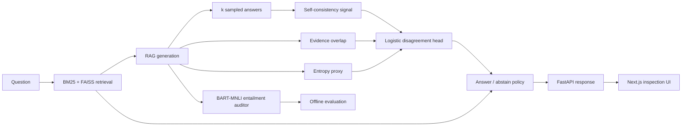

# Disagreement-Aware RAG (Answer / Abstain)

Disagreement-Aware RAG is a retrieval-augmented QA system that decides **whether to answer at all**, not just what answer to generate. It retrieves evidence, generates an answer with citations, measures disagreement and evidence support, and abstains when the response is too unstable or weakly grounded.

**User:** developers evaluating safer grounded-QA behavior.  
**Input:** a natural-language question and an indexed document corpus.  
**Output:** an answer with sources or an explicit abstention, plus the risk features behind that decision.

The project was inspired by *Everyone's Voice Matters: Quantifying Annotation Disagreement Using Demographic Information* (AAAI 2023).

## Why this matters

A RAG system can retrieve relevant text and still produce an answer that is unstable, weakly supported or too confident. This project treats disagreement as a useful signal and turns it into an **answer/abstain policy** rather than exposing a confidence score that has no effect on behavior.

The decision is intentionally inspectable:

```text
Answer iff
    disagreement risk < threshold
    AND evidence overlap >= minimum
    AND self-consistency variance <= maximum
Otherwise abstain
```

The threshold controls the tradeoff between answering more questions and being more conservative.

## Architecture



## How it works

1. **Retrieve** top-k passages with BM25 and FAISS through LlamaIndex.
2. **Generate** a primary answer plus temperature-varied resamples.
3. **Measure** self-consistency, evidence overlap and an uncertainty proxy.
4. **Estimate disagreement risk** with a lightweight logistic-regression head.
5. **Apply the policy** using learned risk plus deterministic evidence/stability gates.
6. **Audit offline** with a zero-shot NLI model against the retrieved evidence.
7. **Inspect behavior** through the API and a Next.js interface that exposes the answer, sources, risk features and policy decision.

## Design evolution

A single learned risk score is not enough to describe why a generated answer should be trusted. An answer can look low-risk to a classifier while still having weak evidence overlap or unstable resampled generations.

The final policy therefore does not delegate the entire decision to one model output. It combines the learned disagreement score with deterministic evidence-overlap and self-consistency gates. That makes the refusal behavior easier to inspect and tune because each rejection has a concrete reason.

## Design tradeoffs

- **Answer/abstain over always-answer behavior:** the system gives up coverage in exchange for an explicit safety mechanism when evidence or generation stability is weak.
- **Lightweight risk head over a larger learned verifier:** logistic regression keeps the feature contribution inspectable and cheap to retrain, while relying more heavily on feature quality.
- **Multiple generation samples over one-shot inference:** resampling provides a useful stability signal but increases inference work.
- **NLI auditing over using generation confidence as the label:** entailment provides an evidence-oriented check, while remaining a model-based auditor rather than a human judgment.
- **Hybrid retrieval over a single retriever:** lexical and vector retrieval cover different query behavior, at the cost of a more involved indexing path.

## Validation

Validation is split between model behavior and application behavior.

### Offline evaluation

`app/scripts/evals.py` rebuilds the coverage/risk artifacts used by the project. The evaluation path:

- runs questions through the retrieval and generation pipeline;
- computes the same risk features used by the serving path;
- applies the answer/abstain rule across configurable thresholds;
- audits answer support with BART-MNLI;
- writes reusable policy artifacts for inspection in the frontend.

### Automated tests

The repository includes tests under [`app/tests/`](app/tests/) for backend behavior and supporting components. The serving API also exposes a health endpoint so the backend can be checked independently from the UI.

## Technology

- **Backend:** FastAPI, Pydantic, scikit-learn, NumPy, Hugging Face Transformers
- **Retrieval:** LlamaIndex, BM25, FAISS
- **Evaluation:** BART-MNLI, Weights & Biases
- **Frontend:** Next.js, React, Recharts
- **Tooling:** Poetry / uv

## Repository map

```text
app/
├── backend/
│   ├── main.py
│   ├── rag.py
│   ├── features.py
│   └── disagreement.py
├── frontend/
├── scripts/
│   ├── evals.py
│   ├── train_head.py
│   ├── data_ingest.py
│   └── data_split.py
├── tests/
└── data/
results/
```

## Run locally

From `app/`:

```bash
poetry install
# or: uv sync
```

Configure the policy and sampling settings in `app/.env`, then start the API:

```bash
poetry run uvicorn backend.main:app --reload --port 8000
```

Start the frontend:

```bash
cd frontend
npm install
npm run dev
```

Open `http://localhost:3000`.

To rebuild the offline evaluation artifacts:

```bash
cd app
poetry run python -m scripts.evals
```

## Key files

- [FastAPI application](app/backend/main.py)
- [Retrieval and answer generation](app/backend/rag.py)
- [Risk features](app/backend/features.py)
- [Disagreement model and decision rule](app/backend/disagreement.py)
- [Offline evaluation](app/scripts/evals.py)
- [Risk-head training](app/scripts/train_head.py)
- [Frontend](app/frontend/)
- [Automated tests](app/tests/)
- [Saved project artifacts](results/)

## Reference

- *Everyone's Voice Matters: Quantifying Annotation Disagreement Using Demographic Information.* AAAI 2023.
- Lewis et al. (2020), *BART: Denoising Sequence-to-Sequence Pre-training for Natural Language Generation, Translation, and Comprehension.*
